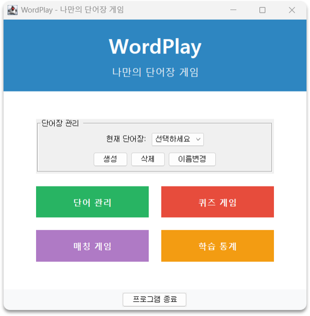

# 📚 WordPlay

Java 기반 단어장 및 단어 학습 프로그램입니다. 단어를 저장하고, 취약 단어를 분석하며, 퀴즈 및 액션 게임을 통해 학습할 수 있습니다.

<br>
<p align="center">
  
</p>
<br>

### 📝 주요 기능

- 다중 단어장 지원 / 관리
- 단어 추가 및 수정, 삭제
- GUI를 통한 직관적인 단어 학습 환경 제공
- 취약 단어 분석 및 학습 통계 시각화
- 퀴즈 게임 / 액션 게임 모드 제공
- 단어 및 단어장 변경 시 데이터 자동 저장 (실시간 DB 저장)

<br>

### 🛠️ 실행 방법

\+ git 설치, Java 17 이상 설치 권장

1. 깃허브 프로젝트를 복제(clone)합니다.
<pre><code>git clone https://github.com/rlo-haa/WordPlay.git</code></pre>
2. 생성된 프로젝트 폴더로 이동합니다.
<pre><code>cd src</code></pre>
3. `WordPlay.java`를 실행합니다.

<br>

### 🗂️ 파일 구성
```markdown
├── src/
│   ├── WordPlay.java
│   ├── WordData.java
│   ├── WordBook.java
│   ├── WordBookManager.java
│   ├── WordManagementGUI.java
│   ├── QuizGameGUI.java
│   ├── ActionGameGUI.java
│   └── StatisticsGUI.java
├── img/
│   └── mainUI.png (README를 위한 이미지)
├── README.md
└── wordbooks.dat/ # github에 없음. 최초 실행시 자동 생성 DB


